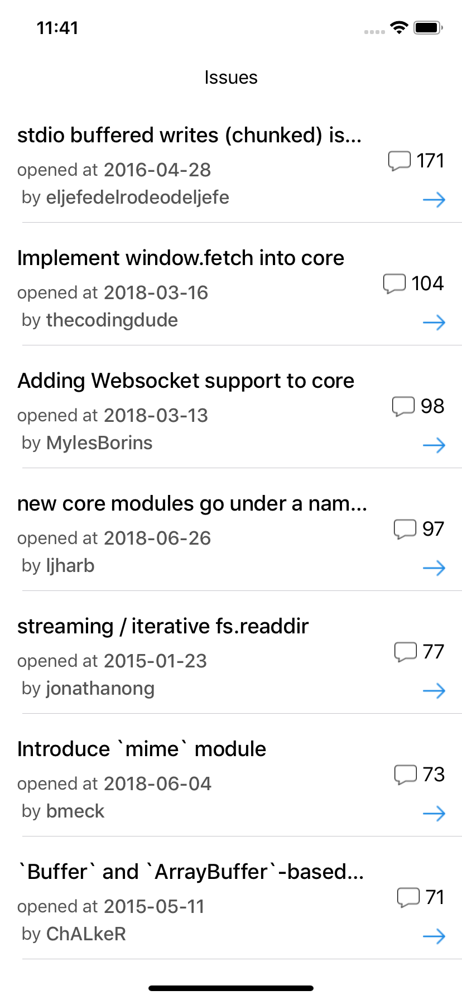

# Github-Search-Issue-App

### About this service

특정 repository의 Issue를 list로 불러오는 앱입니다.

MVVM구조와 RxSwift를 사용하여 구현하였습니다.

Issue를 comments 순으로 최상위 10개와, Issue의 제목과 작성자, 작성일, 코멘트 수를 띄워줍니다.

오른쪽 아래 화살표 버튼을 클릭하면 해당 Issue의 상세정보를 띄워주는 화면으로 이동합니다.

​        

### Skills

- iOS & Swift
- RxSwift
- RxCocoa
- RxAlamofire
- Codable

​      

